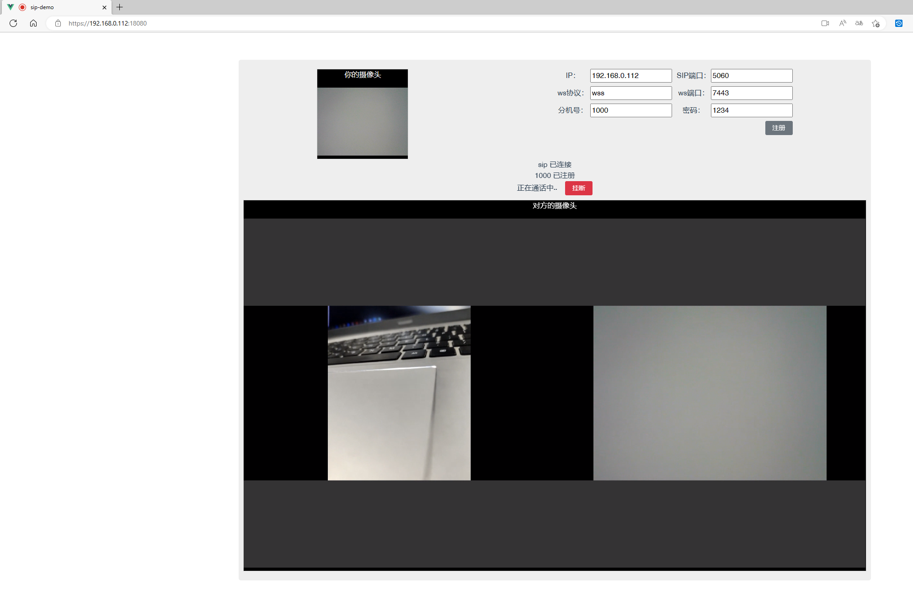

# 项目简介

一个基于sip.js的 voip 演示demo

基于 [kvsur/sip-demo](https://github.com/kvsur/sip-demo) 项目改造。

# 编译运行

```
# 安装模块
npm install
# 运行
npm run start
# 打包
npm run build
```

# 运行演示

访问 [https://localhost:8080/](https://localhost:8080/)



# 自签证书

1. [使用mkcert工具生成受信任的SSL证书，解决局域网本地https访问问题](https://blog.csdn.net/qq_45392321/article/details/119676301)
2. [OpenSSL生成自签名证书脚本（免交互脚本、nginx配置、Chrome信任）](https://blog.csdn.net/pskzs/article/details/125399874)